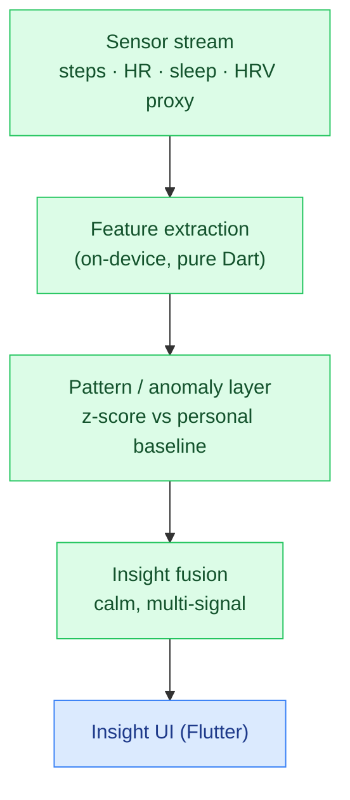

# VitalSwarm

**▶ Live demo: https://parag-labs.github.io/vital-swarm/** — a Flutter app running on the web
(also runs natively via `flutter run`). Everything is on-device; no backend, no API keys.

A privacy-first **on-device continuous health companion**. It takes multi-signal data — steps,
resting heart rate, sleep, and an HRV-based strain proxy — extracts simple features, detects
patterns and anomalies against your own baseline, and **fuses them into calm, non-alarmist
insights**. Sensitive data stays on the device; only you ever see it.

Toggle between an "off day" and a "steady day" to watch the pipeline surface a gentle nudge or a
reassuring all-clear.

---

## Why

Most health apps are cloud-dependent or single-purpose. People want continuous, *private*,
multi-signal intelligence that respects data boundaries and doesn't nag or alarm. VitalSwarm is a
small, modular, testable pipeline that does exactly that, on-device.

## Core idea

The intelligence is a deterministic pipeline in `lib/core/health.dart`, with no Flutter
dependency:

```
day signals → extractFeatures → detect (vs personal baseline, z-score) → insightsFrom (fusion) → calm insights
```

- `extractFeatures` computes window averages.
- `detect` flags any metric where *today* deviates ≥1σ from the baseline of prior days, ordered by
  magnitude.
- `insightsFrom` **fuses related signals** (e.g. low sleep + high strain → one gentle "take it
  easy" nudge) and always returns something calm — never empty-handed, never alarmist.

Keeping it pure means the whole health model is unit-tested and reproducible; the Flutter layer
just renders the insights.

## Architecture



## Demo

```bash
flutter run -d chrome     # web
flutter run               # a device / simulator
```

The **off day** (fewer steps, less sleep, higher strain) produces a fused "a lighter day might
help" nudge; the **steady day** produces a reassuring "a steady day" — showing the pipeline both
detects and *reassures*.

## Design decisions

- **Baselines, not thresholds.** Anomalies are relative to *your* recent history (z-score), so it
  adapts to the individual instead of using one-size-fits-all cutoffs.
- **Fusion over noise.** Related signals combine into a single, actionable insight rather than a
  wall of separate alerts — and the wording is deliberately gentle.
- **Private by default.** The pipeline consumes local signals and emits local insights; nothing is
  designed to leave the device.

## Testing

`flutter test` — 10 tests: feature ranges, anomaly detection (direction + ordering, steady-window
= none, minimum baseline), multi-signal fusion (low sleep + high strain → one nudge; steady day →
positive), non-empty calm output, and determinism throughout.

```bash
flutter test
```

## Roadmap

- Real HealthKit / Health Connect + wearable ingestion behind the `DaySignals` type.
- More features (variability, trends, circadian alignment) and richer fusion.
- Opt-in gentle interventions and a clear on-device data-flow/settings view.

## Layout

```
vital-swarm/
├── lib/
│   ├── core/
│   │   ├── health.dart    # pure Dart: features → detection → insight fusion (unit-tested)
│   │   └── samples.dart   # deterministic demo windows
│   └── main.dart          # calm health dashboard + data-flow visualization
├── test/                  # 10 flutter_test unit tests
└── web/
```

## License

MIT — see [LICENSE](LICENSE).
